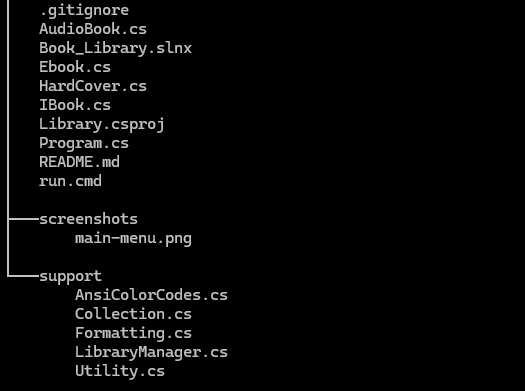
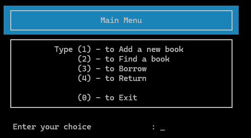
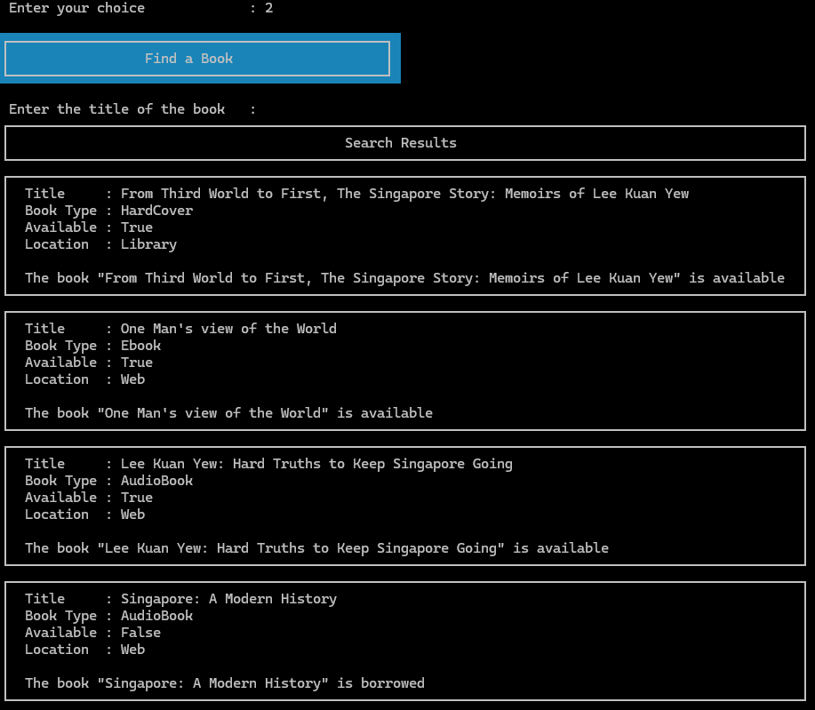
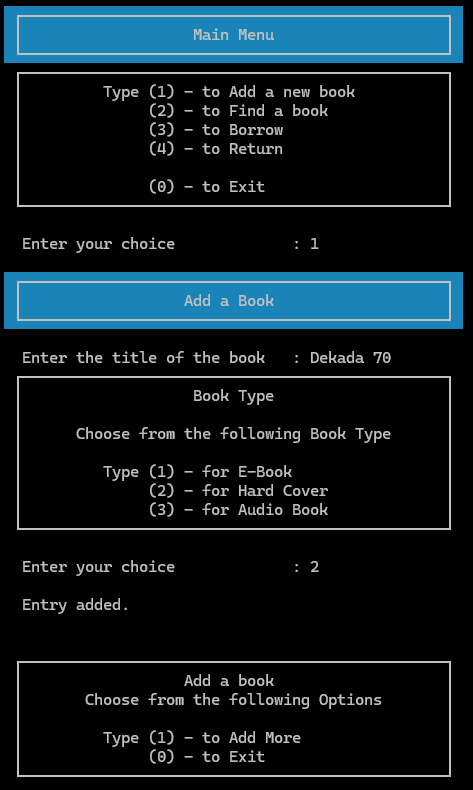
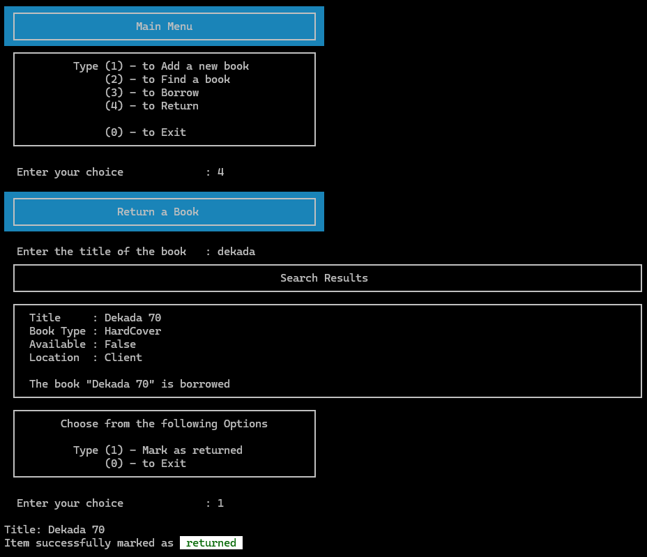
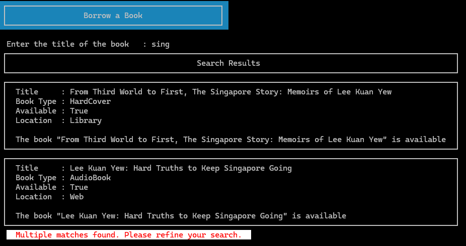
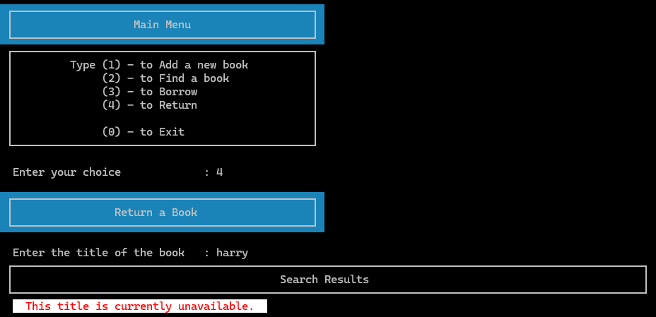

_This README.md file was created with assistance from AI - GitHub Copilot. The remaining code was developed without AI support, except where explicitly indicated in the code comments._

# Book Library

Simple C# console application for managing a small book library (AudioBook, Ebook, HardCover, etc.). This repository contains the source code and supporting files for the `Book_Library` project.

**Project:** `Book_Library`

**Language:** C#

## File and Folder Structure

- `AudioBook.cs`, `Ebook.cs`, `HardCover.cs`, `IBook.cs` — book model types
- `Program.cs` — console program entry point
- `Library.csproj`, `Book_Library.slnx` — project and solution files
- `screenshots/` — place screenshots here (optional)
 - `support/` — helper classes and utilities used by the application


## Files in this repository

Files are located at the project root (no package declared in source files):

- `AudioBook.cs`
	- AudioBook model type. 
- `Ebook.cs`
	- Ebook model type. 
- `HardCover.cs`
	- HardCover model type. 
- `IBook.cs`
	- Interface for book objects. Declares common properties and methods used across book types.
- `Program.cs`
	- Interactive console program entry point. Presents menus, accepts user input and delegates operations to `support/LibraryManager.cs` and other helpers.
- `Library.csproj`, `Book_Library.slnx`
	- Project and solution files used to build the application with `dotnet`.
- `run.cmd`
	- Simple command file to help build/run on Windows (kept for convenience; PowerShell instructions provided above).
- `screenshots/`
	- Folder to add screenshot images referenced in this README.

Support files (under `support/`):

- `support/AnsiColorCodes.cs`
	- ANSI color constants and small helpers for colored console output.
- `support/Collection.cs`
	- Collection helpers for seeding objects .
- `support/Formatting.cs`
	- Console formatting helpers.
- `support/LibraryManager.cs`
	- Higher-level orchestration for library operations (add, remove, list, search books). Serves as the primary API used by `Program.cs`.
- `support/Utility.cs`
	- Miscellaneous utilities (input parsing/validation, simple I/O helpers, small reusable functions).

## Requirements

- .NET SDK (compatible with the target framework used by the project)

## Build (PowerShell `pwsh`)

Open a `pwsh` (PowerShell) terminal in the `Book_Library` folder and run:

```
dotnet build
```

## Run (PowerShell `pwsh`)

After a successful build, run the application with:

```
.\run.cmd
```

## Usage

This is a console app. Typical usage flows are implemented in `Program.cs` and supporting classes under the project root. Open `Program.cs` to see how the application interacts with the `Library` and `IBook` implementations.


## Screenshots

Main menu



Displaying all books from collection (leave the title empty)



Adding a Book 



Borrowing a Book 


Returning a Book 



Errors and retry 






## Requirements

- .NET SDK: Version 10.0.100
- No external libraries
- ANSI-capable terminal (optional, for colors)

## Contact

If you have questions or need further changes, reply here or refer to the course materials.
